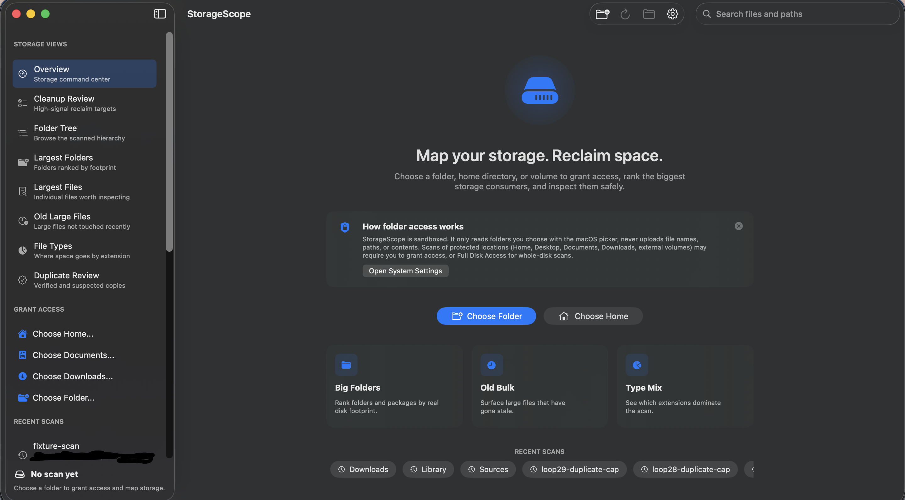

# StorageScope

[](https://github.com/RasputinKaiser/StorageScope/actions/workflows/swift.yml)

[](https://ko-fi.com/W7W7C9TC7)

StorageScope is a free open-source macOS disk space analyzer and Mac storage cleaner for finding the folders and files that are filling a Mac. It is a local-first macOS storage management app, built with SwiftUI/AppKit, for large-folder analysis, duplicate file review, disk usage analysis, and safer cleanup planning.

The app scans only folders the user grants through macOS folder selection or stored security-scoped bookmarks. It does not upload scan results, file names, paths, contents, analytics, or identifiers.

The name is intentional: StorageScope is not a black-box cleaner. It scopes storage pressure, separates verified duplicates from review-only suggestions, and helps the user decide what to reclaim.



## Highlights

- macOS disk space analyzer views for disk usage, file cleanup, old large files, duplicate candidates, and type-heavy storage.
- Reclaim Plan overview that separates verified duplicate reclaim, review-suggested cleanup, and access gaps.
- Ranked storage views for largest folders, largest files, stale large files, and file type usage.
- Folder tree browsing with size bars and an inspector for selected items.
- Duplicate file review that starts from same-size candidates and verifies matches with SHA-256 within a bounded work budget.
- Cleanup review for verified duplicate copies, cache folders, build artifacts, installers, archives, disk images, and temporary-looking files.
- Confirmed file actions for Reveal in Finder, Open, Copy Path, and Move to Trash.
- Transactional cleanup batches that collapse nested selections, disclose mixed-confidence risk, use macOS Trash APIs, and roll back earlier moves if a later move fails.
- Broad-scan memory controls that retain a bounded UI tree while preserving full-scan summary results.

## Use Cases

StorageScope is designed for people looking for a transparent alternative to black-box Mac cleaner utilities:

- Find what is taking up disk space on macOS.
- Use a free Mac storage cleaner that runs locally.
- Review large folders, old large files, installers, archives, disk images, and build artifacts.
- Inspect verified duplicate files separately from review-suggested cleanup.
- Plan Mac storage cleanup locally without uploading file names, paths, hashes, or scan results.
- Explore disk usage with an open-source Swift macOS app instead of a closed cleanup tool.

## Search Terms

StorageScope is useful for people looking for:

- macOS disk space analyzer
- Mac storage cleaner
- free Mac cleaner
- open-source Mac cleaner
- duplicate file finder for macOS
- large folder scanner for Mac
- disk usage analyzer for macOS
- cache cleaner for macOS
- local-first Mac cleanup tool
- SwiftUI macOS storage app

## Requirements

- macOS 14 or newer
- Xcode command line tools with Swift 5.9 or newer

## Build And Run

```bash
bash ./script/build_and_run.sh
```

The script builds a local app bundle at `${TMPDIR}/StorageScope/dist/StorageScope.app` by default, signs it ad hoc with the app sandbox entitlements, and launches it. Some macOS hosts reject temporary ad hoc app bundles at launch time; `--verify` reports that case and falls back to a SwiftPM executable launch probe so local build verification remains useful.

Build without launching:

```bash
bash ./script/build_and_run.sh --build-only
```

Verify build, signature, and launch:

```bash
bash ./script/build_and_run.sh --verify
```

## Test

```bash
swift test
```

The test suite covers scanner ranking, duplicate grouping and verification, bounded duplicate hashing, hidden-file behavior, cleanup candidates, reclaim-plan lanes, transactional Trash rollback, sandbox-aware Trash invocation, nested cleanup selection collapse, and broad-scan retention behavior.

## Public Upload Audit

Before publishing or pushing a release-prep branch, run:

```bash
./script/public_upload_audit.sh
```

The audit checks the exact Git upload candidate set for ignored local artifacts, signing/provisioning files, private distribution outputs, absolute local paths, and common credential patterns. It also runs `swift test`, plist linting, and script syntax checks.

## Open Source Maintenance

StorageScope is intended to be grant- and contributor-friendly:

- MIT licensed for broad open-source use.
- Public issue and pull request templates for reproducible maintenance work.
- Local-first privacy posture with no telemetry or uploaded scan data.
- Automated public-upload audit for credentials, local artifacts, and build sanity.
- Swift tests covering scanner behavior, cleanup safety, duplicate review, and broad-scan memory retention.

## Support StorageScope

StorageScope is open source, and commercial support is available for teams or Mac power users who need packaging help, compatibility testing, priority fixes, or sponsored cleanup workflows.

- Request paid support: https://github.com/RasputinKaiser/StorageScope/issues/new?template=commercial_support.yml
- Star the repository to improve discovery for other Mac users.
- Open focused public issues for cleanup workflows, duplicate-review cases, or packaging needs that would make the app more useful.

Commercial support helps fund packaging, notarization, compatibility testing, and local-first cleanup features without adding telemetry or uploaded scan data.

## Distribution

Create a local DMG:

```bash
./script/export_dmg.sh
```

The DMG is written to `exports/`, which is intentionally ignored by Git.

For public binary downloads outside the Mac App Store, sign with an Apple Developer ID Application certificate and notarize the DMG before uploading. For Mac App Store submission, use `script/package_app_store.sh` with Apple distribution identities and any required provisioning profile.

Do not commit signing identities, provisioning profiles, notarization credentials, exported packages, generated DMGs, local scan outputs, or Codex state.

## Privacy And Permissions

StorageScope uses the standard macOS folder picker for sandbox-safe access. For protected locations such as Desktop, Documents, Downloads, external volumes, home folders, or whole-disk scans, macOS may require the user to grant access or Full Disk Access.

See [PRIVACY.md](PRIVACY.md) and [SECURITY.md](SECURITY.md) for the public privacy and security notes.

## Project Layout

```text
Sources/StorageScope/         macOS app shell, stores, services, and SwiftUI views
Sources/StorageScopeCore/     scanner models and core storage/cleanup logic
Tests/StorageScopeCoreTests/  scanner and cleanup safety tests
Resources/                   app icon, privacy manifest, and DMG README
Config/                      app sandbox entitlements
script/                      build, package, export, icon, and upload-audit helpers
```

## License

StorageScope is open-source under the [MIT License](LICENSE).
