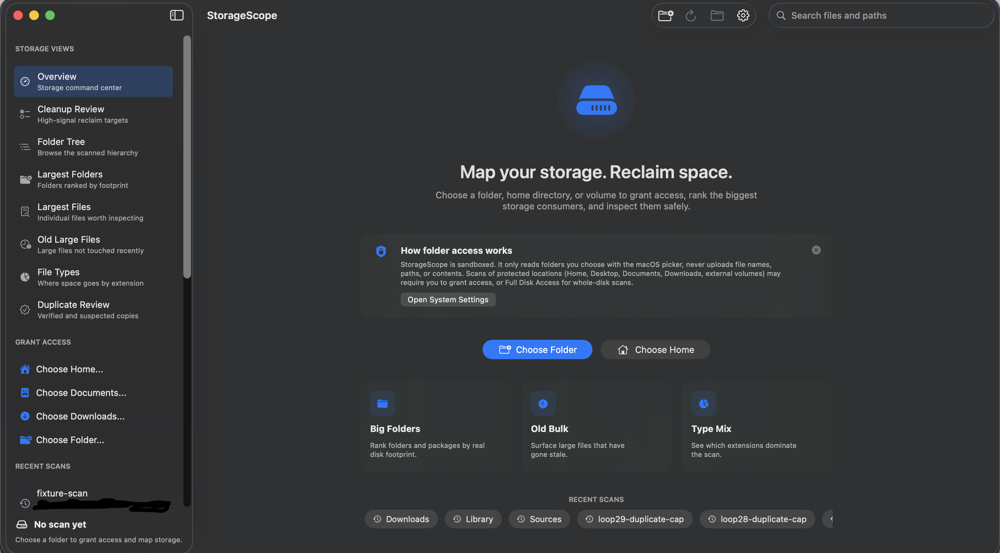
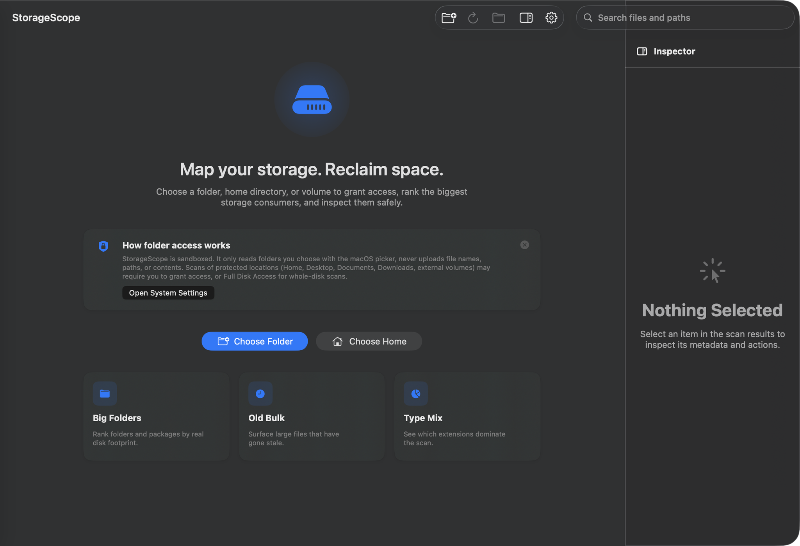
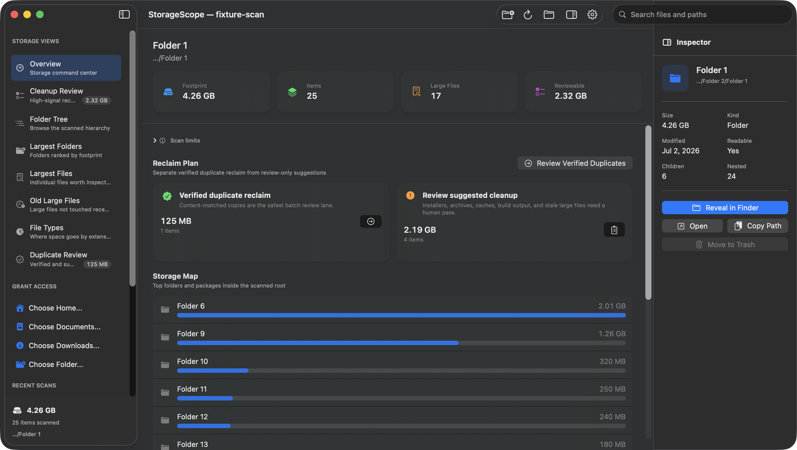
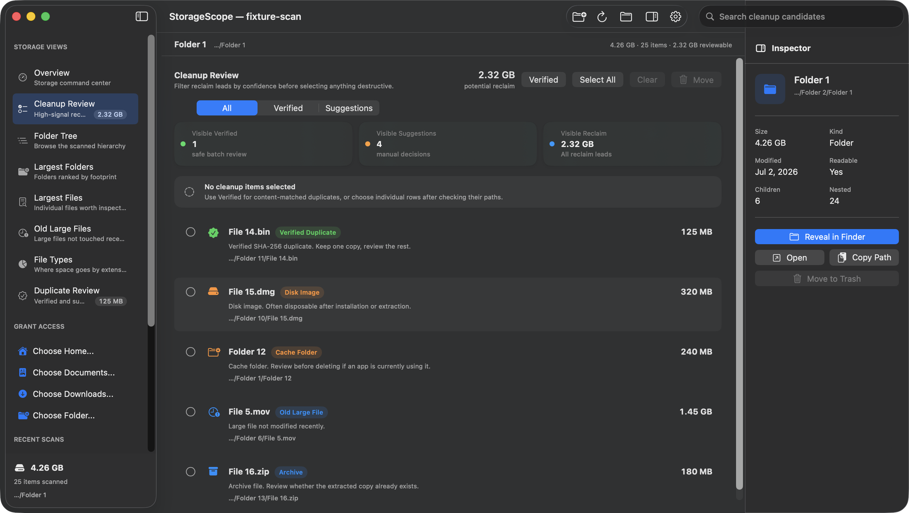
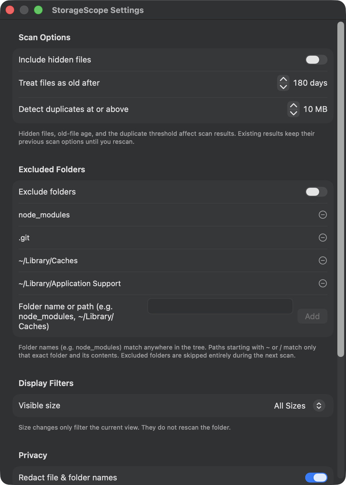

# StorageScope

[](https://github.com/RasputinKaiser/StorageScope/actions/workflows/swift.yml)

[](https://ko-fi.com/W7W7C9TC7)

StorageScope is a free open-source macOS disk space analyzer and Mac storage cleaner for finding the folders and files that are filling a Mac. It is a local-first macOS storage management app, built with SwiftUI/AppKit, for large-folder analysis, duplicate file review, disk usage analysis, and safer cleanup planning.

The app scans only folders the user grants through macOS folder selection or stored security-scoped bookmarks. It does not upload scan results, file names, paths, contents, analytics, or identifiers.

The name is intentional: StorageScope is not a black-box cleaner. It scopes storage pressure, separates verified duplicates from review-only suggestions, and helps the user decide what to reclaim.

**Current release:** v0.8.0, with incremental rescanning and fixes across search navigation, duplicate review, Trash review, and hash-cache persistence.

[Download v0.8.0](https://github.com/RasputinKaiser/StorageScope/releases/download/v0.8.0/StorageScope-0.8.0.dmg) · [SHA-256 checksum](https://github.com/RasputinKaiser/StorageScope/releases/download/v0.8.0/StorageScope-0.8.0.dmg.sha256) · [Changelog](docs/changelog.html) · [Privacy](PRIVACY.md) · [GitHub Pages](https://rasputinkaiser.github.io/StorageScope/)

The GitHub DMG is for Apple Silicon Macs running macOS 14 or newer. It is ad hoc signed and has not been notarized by Apple. If macOS declines to open it, you can [build from source](#build-and-run) or wait for a notarized build. Intel Macs have not been validated for this release.



**Start here:** [First Scan](#first-scan) · [Build From Source](#build-and-run) · [Troubleshooting](#troubleshooting) · [Contributing](CONTRIBUTING.md) · [FAQ](docs/faq.html) · [Keyboard Shortcuts](docs/keyboard-shortcuts.html)

## First Scan

1. Download the DMG linked above, or [build from source](#build-and-run). For the DMG, copy `StorageScope.app` to Applications before opening it.
2. Click **Choose Folder** and select a small folder you know. The macOS picker grants access to that location; broader scans can have additional access gaps.
3. Inspect the Overview, largest files/folders, and folder tree. Scanning does not move files to Trash.
4. In Duplicate Review and Cleanup Review, keep **verified duplicates** separate from **review suggestions**. Matching sizes, age, or a cache-like name alone are not proof that a file is safe to remove.
5. Use **Reveal in Finder** or **Open** to inspect candidates, then review the selected batch before confirming **Move to Trash**. On a batch failure, StorageScope attempts to restore earlier moves; if restoration also fails, some items may remain in Trash. Read the error and inspect Finder Trash before retrying. Do not empty Trash until you are sure you no longer need the files.

## What's New In v0.8.0

- Incremental rescanning reuses unchanged scan state and tracks changed folders, with a conservative full-scan fallback when saved state or event history cannot be trusted.
- Find Next and Find Previous now follow the displayed search scope, reset after query or view changes, and reveal matches inside collapsed folder trees.
- Duplicate Review includes smaller unverified same-size groups in All Sizes and keeps verified copies separate from suggestions.
- Trash review detects candidates that disappeared before confirmation. Hash-cache limits and deleted-cache recovery are more reliable.
- The final local audit passed 251 tests across 26 suites. See the [v0.8.0 release notes](docs/releases/v0.8.0.md) for measured, fixture-specific duplicate verification results.

## Highlights

- macOS disk space analyzer views for disk usage, file cleanup, old large files, duplicate candidates, and type-heavy storage.
- Reclaim Plan overview that separates verified duplicate reclaim, review-suggested cleanup, and access gaps.
- Ranked storage views for largest folders, largest files, stale large files, and file type usage.
- Folder tree browsing with size bars and an inspector for selected items.
- Duplicate file review that starts from same-size candidates and verifies matches with SHA-256 within a bounded work budget.
- Cleanup review for verified duplicate copies, cache folders, build artifacts, installers, archives, disk images, and temporary-looking files.
- Confirmed file actions for Reveal in Finder, Open, Copy Path, and Move to Trash.
- Transactional cleanup batches that collapse nested selections, disclose mixed-confidence risk, use macOS Trash APIs, and attempt to roll back earlier moves if a later move fails.
- Broad-scan memory controls that retain a bounded UI tree while preserving full-scan summary results.

## Screenshots

These screenshots are a v0.7.1 interface reference, not new v0.8.0 captures. They were made with redaction mode enabled, so placeholder names are visible while sizes, counts, and cleanup classifications remain real.

| Cold Launch | Scanned Overview |
| --- | --- |
|  |  |

| Cleanup Review | Privacy Setting |
| --- | --- |
|  |  |

## Use Cases

StorageScope is designed for people looking for a transparent alternative to black-box Mac cleaner utilities:

- Find what is taking up disk space on macOS.
- Use a free Mac storage cleaner that runs locally.
- Review large folders, old large files, installers, archives, disk images, and build artifacts.
- Inspect verified duplicate files separately from review-suggested cleanup.
- Plan Mac storage cleanup locally without uploading file names, paths, hashes, or scan results.
- Explore disk usage with an open-source Swift macOS app instead of a closed cleanup tool.

## Search Terms

StorageScope is useful for people looking for:

- macOS disk space analyzer
- Mac storage cleaner
- free Mac cleaner
- open-source Mac cleaner
- duplicate file finder for macOS
- large folder scanner for Mac
- disk usage analyzer for macOS
- cache cleaner for macOS
- local-first Mac cleanup tool
- SwiftUI macOS storage app

## Requirements

- macOS 14 or newer
- Xcode command line tools with Swift 5.9 or newer for source builds
- macOS is required for the app and its AppKit/SwiftUI test targets; Linux and Windows are not supported build hosts

The Swift package declares no third-party package dependencies. The current downloadable DMG is Apple Silicon-only; Intel source builds are not validated by the release evidence.

## Build And Run

From Terminal, clone the repository and enter its root:

```bash
git clone https://github.com/RasputinKaiser/StorageScope.git
cd StorageScope
swift --version
bash ./script/build_and_run.sh
```

The script builds a local app bundle at `${TMPDIR:-/tmp}/StorageScope/dist/StorageScope.app` by default, signs it ad hoc with the app sandbox entitlements, and launches it. It stops running processes named `StorageScope` and replaces that generated app bundle, including in `--build-only` mode. If you override `STORAGESCOPE_DIST_DIR`, use a dedicated build-output directory.

In `--verify` mode, if the bundle launch command succeeds but the app does not remain running, the script falls back to a SwiftPM executable launch probe. A successful fallback checks the executable launch, not that the packaged app stays running.

Build without launching:

```bash
bash ./script/build_and_run.sh --build-only
```

Verify build, signature, and launch:

```bash
bash ./script/build_and_run.sh --verify
```

## Test

```bash
swift test
```

The test suite covers scanner ranking, duplicate grouping and verification, bounded duplicate hashing, hidden-file behavior, cleanup candidates, reclaim-plan lanes, transactional Trash rollback, sandbox-aware Trash invocation, nested cleanup selection collapse, and broad-scan retention behavior.

## Troubleshooting

- **`swift` is missing or the build uses an unexpected toolchain:** check `swift --version` and `xcode-select -p`, and install/select a macOS Xcode command line toolchain compatible with the requirements above. Run commands from the cloned repository root.
- **macOS blocks the downloaded app:** the current DMG is ad hoc signed and unnotarized. Use the source-build route or wait for a notarized release; this README does not require disabling macOS security checks.
- **Folders are inaccessible or totals seem incomplete:** choose the folder again with the macOS picker, review the scan's access gaps, and check the permissions described below. Grant only the access needed for the folder you want to inspect, then rescan.
- **Items changed or disappeared before cleanup:** rescan and review the batch again. The Trash operation checks target state and duplicate keepers before moving files.
- **A Trash batch fails:** inspect the error for restored items and items still in Trash before trying again. Rollback is attempted, but is not guaranteed to succeed.
- **Need help reproducing a bug:** follow [SUPPORT.md](SUPPORT.md), or use the [developer fixture instructions and safety notes](CONTRIBUTING.md#developer-fixtures). Redact file and folder names before sharing screenshots; do not post private paths or scan contents.

## Public Upload Audit

Before publishing or pushing a release-prep branch, run:

```bash
./script/public_upload_audit.sh
```

The audit checks the exact Git upload candidate set for ignored local artifacts, signing/provisioning files, private distribution outputs, absolute local paths, and common credential patterns. It also runs `swift test`, plist linting, script syntax checks, and mocked release-script behavior checks.

## Open Source Maintenance

StorageScope is intended to be grant- and contributor-friendly:

- MIT licensed for broad open-source use.
- Public issue and pull request templates for reproducible maintenance work.
- Local-first privacy posture with no telemetry or uploaded scan data.
- Automated public-upload audit for credentials, local artifacts, and build sanity.
- Swift tests covering scanner behavior, cleanup safety, duplicate review, and broad-scan memory retention.

## Support StorageScope

StorageScope is open source, and commercial support is available for teams or Mac power users who need packaging help, compatibility testing, priority fixes, or sponsored cleanup workflows.

- Request paid support: https://github.com/RasputinKaiser/StorageScope/issues/new
- Star the repository to improve discovery for other Mac users.
- Open focused public issues for cleanup workflows, duplicate-review cases, or packaging needs that would make the app more useful.

Commercial support helps fund packaging, notarization, compatibility testing, and local-first cleanup features without adding telemetry or uploaded scan data.

## Distribution

Create a local DMG:

```bash
./script/export_dmg.sh
```

The DMG is written to `exports/`, which is intentionally ignored by Git.

The v0.8.0 GitHub DMG contains an Apple Silicon binary and is ad hoc signed and unnotarized. The repository also includes a Developer ID signing and notarization workflow for a future distribution build. For Mac App Store submission, use `script/package_app_store.sh` with Apple distribution identities and any required provisioning profile.

Do not commit signing identities, provisioning profiles, notarization credentials, exported packages, generated DMGs, local scan outputs, or Codex state.

## Privacy And Permissions

StorageScope uses the standard macOS folder picker for sandbox-safe access. For protected locations such as Desktop, Documents, Downloads, external volumes, home folders, or whole-disk scans, macOS may require the user to grant access or Full Disk Access.

See [PRIVACY.md](PRIVACY.md) and [SECURITY.md](SECURITY.md) for the public privacy and security notes.

## Project Layout

```text
Sources/StorageScope/         macOS app shell, stores, services, and SwiftUI views
Sources/StorageScopeCore/     scanner models and core storage/cleanup logic
Tests/StorageScopeCoreTests/  scanner and cleanup safety tests
Tests/StorageScopeTests/      app state, navigation, permission, and Trash-review tests
Sources/StorageScopeBenchmark/ command-line scanner benchmark
docs/                        GitHub Pages guides, release notes, and performance evidence
Resources/                   app icon, privacy manifest, and DMG README
Config/                      app sandbox entitlements
script/                      build, package, export, icon, and upload-audit helpers
```

## License

StorageScope is open-source under the [MIT License](LICENSE).
